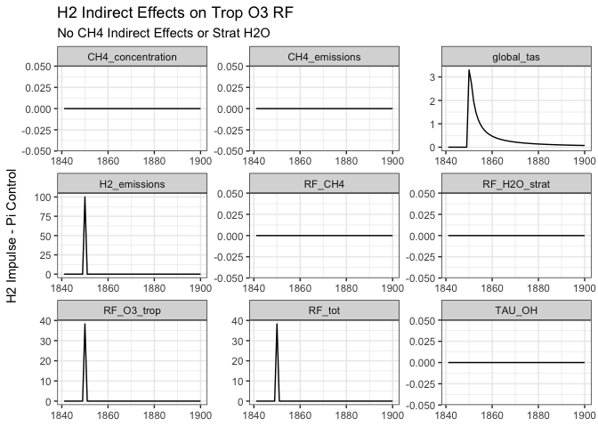
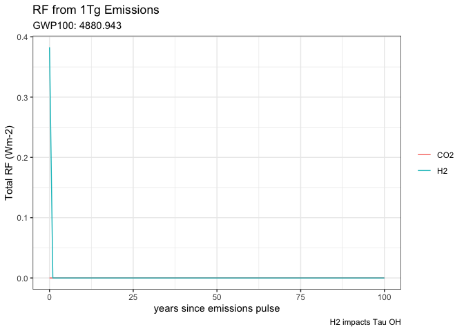

PR-779: H2 effects on Trop. O3 RF
================
2025-04-08

Make plots for <https://github.com/JGCRI/hector/pull/779> where we add
the indirect H2 effects on trop O3 radiative forcing.

``` r
BASE_DIR <- here::here("dev", "PR-779")

library(dplyr)

# TODO this needs to be a specific version of Hector will want to replace with the 
# git ssha after the PR is approved
HECTOR_DIR <- "/Users/dorh012/Documents/2024/H2Materials/Hector_H2_Project/../hector"
devtools::load_all(HECTOR_DIR) # this is a specific version of Hector
library(ggplot2)
theme_set(theme_bw())
```

# Implementation

(S10) from Dorheim et al. 2024 for our previous $RF_{O_3}$ equation, we
had

$$ RF_{O_3}(t) = 0.043 [O_3](t)$$

The new implementation includes the effects of H2 is

$$ RF_{O_3}(t) = 0.043 [O_3](t) + 0.3827 H2 (t)$$

As written in the EMTC manuscript - where did this value come from?

# Trop O3 Effects Only

To start let’s isolate the RF strat h2o vapor effects, by making sure
the H2 effects on CH4 are set to 0.

``` r
# Helper function that sets up a hector core but make sure that the other H2 indrect effects are set to 0
my_newcore <- function(ini, name){
    hc <- newcore(ini_file, name = "control")
    setvar(hc, NA, "CH2", values = 0, unit = "(undefined)")
    setvar(hc, NA, "rho_h2o_h2", values = 0, unit = "W/m2/Tg")
    return(hc)
    
}


# Add in this helper function for the moment since the R bindings had been depreciated
COEFF_H2 <- function(){"CH2"}
```

``` r
# Information that is constant for for all of our hector runs
dates <- 1750:2000
vars <- c(EMISSIONS_CH4(), EMISSIONS_H2(), CH4_LIFETIME_OH(), CONCENTRATIONS_CH4(),
          RF_CH4(), RF_H2O_STRAT(), RF_O3_TROP(), RF_TOTAL(), GLOBAL_TAS())
ini_file <- file.path(BASE_DIR, "inputs", "picontrol_ch4-emiss.ini")
IMPULSE_YR <- 1850

# The control run
hc <- newcore(ini_file, name = "control")
setvar(hc, NA, COEFF_H2(), values = 0, unit = "(undefined)")
run(hc)
```

    ## Hector core: control
    ## Start date:  1745
    ## End date:    2300
    ## Current date:    2300
    ## Input file:  /Users/dorh012/Documents/2024/H2Materials/Hector_H2_Project/dev/PR-779/inputs/picontrol_ch4-emiss.ini

``` r
out1 <- fetchvars(hc, dates, vars)


# Impulse 1
H2_PULSE <- 100
hc <- my_newcore(ini_file, name = paste0("h2 impulse: ", H2_PULSE))
setvar(hc, IMPULSE_YR, var =  EMISSIONS_H2(), values =H2_PULSE,
       unit = getunits(EMISSIONS_H2()))
reset(hc)
```

    ## Hector core: control
    ## Start date:  1745
    ## End date:    2300
    ## Current date:    1745
    ## Input file:  /Users/dorh012/Documents/2024/H2Materials/Hector_H2_Project/dev/PR-779/inputs/picontrol_ch4-emiss.ini

``` r
run(hc)
```

    ## Hector core: control
    ## Start date:  1745
    ## End date:    2300
    ## Current date:    2300
    ## Input file:  /Users/dorh012/Documents/2024/H2Materials/Hector_H2_Project/dev/PR-779/inputs/picontrol_ch4-emiss.ini

``` r
out2 <- fetchvars(hc, dates, vars)
```

Let’s take a look at the difference results from an impulse of H2
emissions in 1850 and a pi control run.

``` r
out2 %>% 
    mutate(value = value - out1$value) %>% 
    filter(year > 1840 & year <= 1900) %>% 
    ggplot(aes(year, value)) + 
    geom_line() + facet_wrap("variable", scales = "free") + 
    labs(title = "H2 Indirect Effects on Trop O3 RF", 
         subtitle = "No CH4 Indirect Effects or Strat H2O", 
         y = "H2 Impulse - Pi Control", 
         x = NULL)
```


So as we would expect we only see changes in the RF_O3 trop and
downstream from there.

## GWP100

Sand et al. report the AWGP 100 for H2 from various ESMs have included
results broken down by each of the three indirect $H_2$ effects so we
can use that to compare our $H_2$ implementation here.

$$\text{GWP}_{100} = \frac{\int_{0}^t \Delta \text{RF H}_2}{\int_{0}^t \Delta \text{RF CO}_2}$$
where the $\Delta \text{RF H}_2$ is from a pulse of 1 Tg of $\text{H}_2$
and $\Delta \text{RF CO}_2}$ is from a pulse of 1 Tg of $\text{CO}_2}$.

### CO2 pulse runs

Since we don’t have a emission driven pi control (for CO2) we have to
apply the pulse on top of a control run.

``` r
# Set information we would like to collect from the hector runs
dates <- 1750:2100
vars <- c(c(RF_CO2(), RF_TOTAL(), GLOBAL_TAS(), CH4_LIFETIME_OH(), RF_O3_TROP(),
            FFI_EMISSIONS(), RF_H2O_STRAT()))

# Our control run 
inifile <- file.path(HECTOR_DIR, "inst", "input", "hector_ssp245.ini")
hc <- newcore(inifile, name = "control")
run(hc)
```

    ## Hector core: control
    ## Start date:  1745
    ## End date:    2300
    ## Current date:    2300
    ## Input file:  /Users/dorh012/Documents/2024/H2Materials/hector/inst/input/hector_ssp245.ini

``` r
fetchvars(hc, dates, vars) %>%
    rename(control = value) ->
    out1
shutdown(hc)
```

    ## Hector core (INACTIVE)

``` r
# Impulse run
IMPULSE_YR <- 1850
inifile <- file.path(HECTOR_DIR, "inst", "input", "hector_ssp245.ini")
hc <- newcore(inifile, name = "impulse")
run(hc)
```

    ## Hector core: impulse
    ## Start date:  1745
    ## End date:    2300
    ## Current date:    2300
    ## Input file:  /Users/dorh012/Documents/2024/H2Materials/hector/inst/input/hector_ssp245.ini

``` r
contorl_emiss_val <- fetchvars(hc, IMPULSE_YR, FFI_EMISSIONS())$value
# We want our pulse to only equivalent to 1 Tg of CO2 but Hector inputs are in 
# Pg C so need to convert before adding the pulse to 
CO2_Tg <- 1 
CONVERSION_FACTOR <- (12.01/44.01) * 1e-3 # convert from Tg CO2 to PgC 
impulse <- contorl_emiss_val + (CO2_Tg * CONVERSION_FACTOR)
setvar(hc, IMPULSE_YR, FFI_EMISSIONS(), impulse, getunits(FFI_EMISSIONS()))
reset(hc)
```

    ## Hector core: impulse
    ## Start date:  1745
    ## End date:    2300
    ## Current date:    1745
    ## Input file:  /Users/dorh012/Documents/2024/H2Materials/hector/inst/input/hector_ssp245.ini

``` r
run(hc)
```

    ## Hector core: impulse
    ## Start date:  1745
    ## End date:    2300
    ## Current date:    2300
    ## Input file:  /Users/dorh012/Documents/2024/H2Materials/hector/inst/input/hector_ssp245.ini

``` r
fetchvars(hc, dates, vars) %>%
    rename(impulse = value) ->
    out2
shutdown(hc)
```

    ## Hector core (INACTIVE)

``` r
# Because of the way that Hector's carbon cycle runs offset the impulse year by 1 
out1 %>%
    cbind(impulse = out2$impulse) %>%
    mutate(value = impulse - control) %>%
    mutate(year = year - (IMPULSE_YR+1)) %>%
    filter(year >= 0) %>%
    filter(year <= 100) %>%
    select(year, variable, value, units) ->
    co2_100_rslts
```

### H2 pulse runs

``` r
# Information that is constant for for all of our hector runs
vars <- c(EMISSIONS_H2(), EMISSIONS_CH4(), CONCENTRATIONS_CH4(),
          CH4_LIFETIME_OH(), RF_CH4(), RF_TOTAL(), GLOBAL_TAS(),
          RF_H2O_STRAT(), RF_O3_TROP(), RF_CO2())
ini_file <- file.path(BASE_DIR, "inputs", "picontrol_ch4-emiss.ini")
IMPULSE_YR <- 1850

# Impulse 1
H2_PULSE <- 1
hc <- my_newcore(ini = ini_file, name = paste0("h2 impulse: ", H2_PULSE))
setvar(hc, IMPULSE_YR, var =  EMISSIONS_H2(), values =H2_PULSE,
       unit = getunits(EMISSIONS_H2()))


reset(hc)
```

    ## Hector core: control
    ## Start date:  1745
    ## End date:    2300
    ## Current date:    1745
    ## Input file:  /Users/dorh012/Documents/2024/H2Materials/Hector_H2_Project/dev/PR-779/inputs/picontrol_ch4-emiss.ini

``` r
run(hc)
```

    ## Hector core: control
    ## Start date:  1745
    ## End date:    2300
    ## Current date:    2300
    ## Input file:  /Users/dorh012/Documents/2024/H2Materials/Hector_H2_Project/dev/PR-779/inputs/picontrol_ch4-emiss.ini

``` r
# Format output 
fetchvars(hc, dates, vars) %>%
    mutate(year = year - IMPULSE_YR) %>%
    filter(year >= 0) %>%
    filter(year <= 100) %>%
    select(year, variable, value, units) ->
    h2_100_rslts
```

Integrate the pulse run results and calculate the AGWP100

``` r
# Calculate the GWP100 as the ratio of the cumulative RF change 100 years (integrated)
co2_integral <- summarise(co2_100_rslts, value = sum(value), .by = c("variable"))
h2_integral <- summarise(h2_100_rslts, value = sum(value), .by = c("variable"))

# This is consistent with the model mean GWP 100 due to CH4 from Sand et al.
# Supplementary Table 6
GWP100 <- round(h2_integral$value[h2_integral$variable == "RF_tot"] / co2_integral$value[co2_integral$variable == "RF_tot"], 3)


paste0("GWP100 H2: ", GWP100)
```

    ## [1] "GWP100 H2: 4880.943"

``` r
h2_100_rslts$type <- "H2"
co2_100_rslts$type <- "CO2"


h2_100_rslts %>%
    bind_rows(co2_100_rslts) %>%
    filter(variable == RF_TOTAL()) %>%
    ggplot(aes(year, value, color = type))+
    geom_line() +
    labs(title = "RF from 1Tg Emissions",
         subtitle = paste0("GWP100: ", GWP100),
         caption = "H2 impacts Tau OH",
         x = "years since emissions pulse",
         y = "Total RF (Wm-2)") +
    theme(legend.title = element_blank())
```



Questions \* Where did this coefficient come from?
